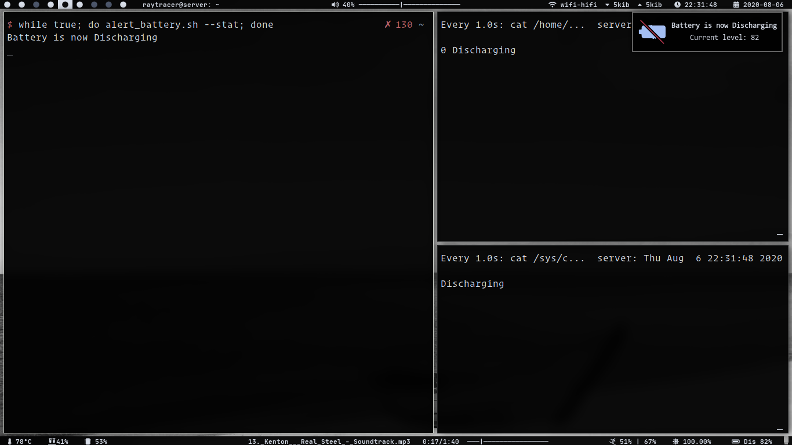
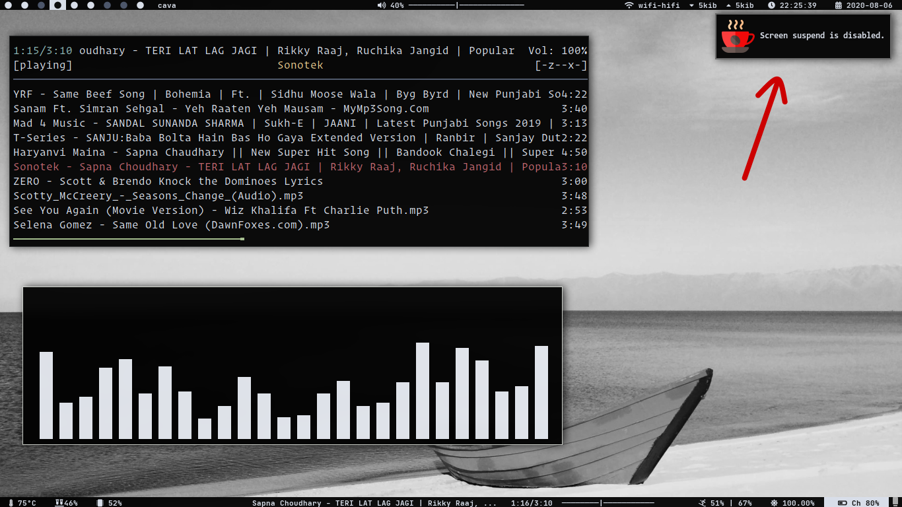
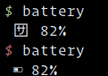

# battery-status

Show different battery status

We loose some of the features when we move from a `DE` to a `WM`. One of them is showing battery status.
So, here's the script to fulfill the purpose

## alert_battery.sh

Let's see what this can do:

* **battery charging**:

* **battery_dischargning**:

This script gives the notification for different battery status like `charging, discharging, charged, and below critical level`

Following options can be passed with script:
* **--stat**: gives all 4 battery status notification
* **--help**: shows help menu
* **no option**: no option only runs the script to show the notification when battery reaches critical level

It is recommended to use this script with `cronjob` or some other job schedular if you are running script with no option

For showing all 4 status script should run every second, so that it can detect battery status

## caffeine_like

Mimicking the caffeine features from `DE`:

Give a keybind to this script, and toggle the caffiene feature

Also, I don't like my computer turn its screen off every 5 minute, so I have give this script to `.xprofile`

## battery

This simple shows battery status in terminal if you are very much minimal using things `wm` without statusbar or notification daemon or in some cases using `tty`

