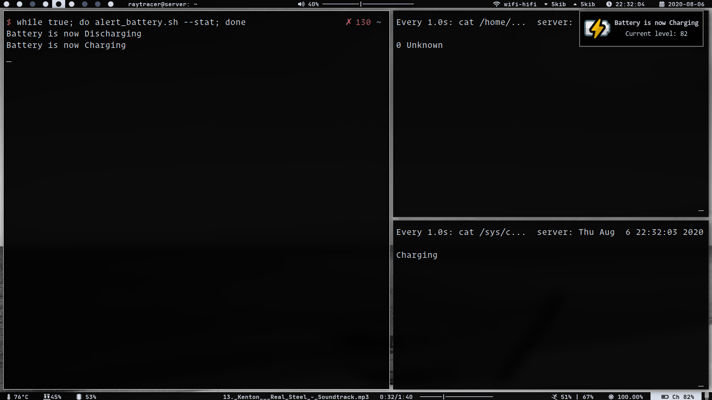

# battery-status

Show different battery status

We loose some of the features when we move from a `DE` to a `WM`. One of them is showing battery status.
So, here's the script to fulfill the purpose

## alert_battery.sh

Let's see what this can do:

* **battery charging**:

* **battery_discharging**:

This script gives the notification for different battery status like `charging, discharging, charged, and below critical level`

Following options can be passed with script:
* **--stat**: gives all 4 battery status notification
* --critical: set the critical level first time when you run the script for the first time as `./alert_battery.sh --critical 25`
* **--help**: shows help menu
* **no option**: no option only runs the script to show the notification when battery reaches critical level

It is recommended to use this script with `cronjob` ~~or some other job schedular~~ if you are running script with no option

For showing all 4 status script should run continuously, so that it can detect battery status

## alert_battery_wrapper.sh

This script is the wrapper script for `alert_battery.sh` script, which means after setting the critical level with the `alert_battery.sh` script, run this script.

You should provide this script to `.xinitrc` or some other sort of startup utility and this will the run the above script in loop.

But, if you just want to display only critical state, don't use this script, use `alert_battery.sh` (without any arg).

## caffeine_like

Mimicking the caffeine features from `DE`:

Give a key-binding to this script, and toggle the caffeine feature

Also, I don't like my computer turn its screen off every 5 minute, so I have give this script to `.xprofile`

## battery

This simple shows battery status in terminal if you are very much minimal using things `wm` without statusbar or notification daemon or in some cases using `tty`

